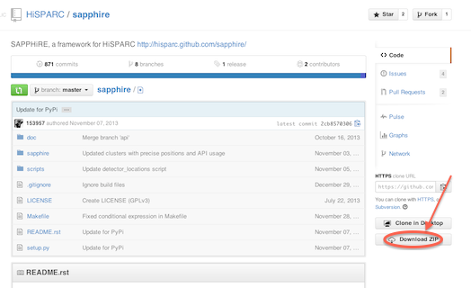

.. include:: subst.inc

Installation
************

Python is a very versatile language. As such, it can be either installed with
lots and lots of packages to create an environment for e.g. data analysis or
game development, or it can be installed for a very specific task, taking up
much less space. To install a complete environment without all the hassle, you
can install a *Python distribution* which includes Python 2.7 and a long list
of packages. This is the recommended approach, certainly if you're new to
Python. If you really want, you can install a much smaller set of packages for
which we'll provide minimal instructions only.

Before we'll go on describing how to install |sapphire| itself, we will first
install the prerequisites.

Installing the prerequisites
============================

Python distributions
--------------------

If you don't mind to install a large package, use a distribution. This mostly
includes everything you'll ever need. One such distribution is `Anaconda
<https://www.continuum.io/downloads>`_. It includes many scientific python
packages, as well as graphical environments for doing your work. Anaconda has
packages available for the three major platforms: Windows, OS X and Linux.

.. note:: Use the installer for **Python 2.7**. |sapphire| does **not** support Python 3.x.

Anaconda includes a graphical programming environment (`Spyder
<http://pythonhosted.org/spyder/>`_) which makes it easy to write analysis
scripts while creating plots, testing small snippets of code, or inspecting
your variables.

Minimal installation (miniconda)
--------------------------------

In theory, installing a Python package should be very easy. To install
|sapphire|, the Python package called ``sapphire`` would be retrieved from the
internet.  It would have its dependencies listed and ``pip`` would pull them in
and all should be well.  In fact, |sapphire| *does* have its dependencies
listed and Pip *will* pull them in.  It is only then, that things start go
wrong.  Whether you'll experience difficulties depends on the operating system
you're using and any previously installed software. But don't worry, we've got
you covered.

Miniconda is the package manager used by the Anaconda distribution.
Installation instructions can be found at
http://conda.pydata.org/docs/install/quick.html. After installation, install
the following packages::

    $ conda install matplotlib scipy pytables

This is enough to simply install |sapphire| using Pip (see below).

Minimal installation (OS-specific)
----------------------------------

If you want to use a package manager specifically for your OS, follow the
(minimal) instructions below for your operating system of choice.

Mac OS X
^^^^^^^^

If you're using Mac OS X, the easiest way to install open source software
(like Python, the program language we're using) including lots and lots of
great packages, is done using `Homebrew
<https://mxcl.github.com/homebrew/>`_.  Please follow the installation
instructions (really easy) and when done, type the following into a
terminal::

    $ brew install python

This will install Python and Pip.

As of this writing, several of the dependencies listed by |sapphire| do not
have their own dependencies listed in a way that Pip (or other tools, for that
matter) know how to handle. To install matplotlib with its requirements, you
can type::

    $ brew install homebrew/python/matplotlib

Warning: this will install gcc and start a very long compilation process. Alternatively, with the introduction of *wheels* in Python, you can simply try to install packages like numpy, scipy and matplotlib using Pip::

    $ pip install numpy scipy matplotlib

If you're lucky, using a wheel will not need a compiler. We haven't tried this
ourselves for quite a while. YMMV.

Debian and derivatives (like Ubuntu)
^^^^^^^^^^^^^^^^^^^^^^^^^^^^^^^^^^^^

Debian has a first-class package manager which other distributions and
operating systems have a hard time competing with.  In my personal opinion,
anyway.  Lots of Python packages can be installed using ``apt-get``, but some
of them might be outdated, depending on the age of your distribution.  Use
``apt-get`` for Python packages at your own discretion (read: risk).  Pip
handles Python packages very well, so you'll probably need some packages to
install using Pip.

As of this writing, several of the dependencies listed by |sapphire| do not
have their own dependencies listed in a way that Pip (or other tools, for
that matter) know how to handle.  Furthermore, matplotlib needs to be
installed all by itself, and its dependencies must be installed before it.

You can try to install packages using ``apt-get``, for example::

    $ sudo apt-get install python-matplotlib

To figure out what you need, look at the prerequisites for |sapphire|, listed
in the setup.py file in the code repository. You can also try to install
|sapphire| using pip, and waiting for the installation to fail on some
prerequisites. If you then need development libraries, ``apt-get`` can help you
with that::

    $ sudo apt-get build-dep python-numpy

will install everything you need to build numpy from source.

Installing |sapphire|
=====================

The |sapphire| package has been uploaded to `PyPI
<http://pypi.python.org>`_ so that Pip knows where to find it.

There are now several scenarios for installing |sapphire|: let Pip
install the release or development version or download the source code
and use setup.py to install it.

Just let me get to work!
------------------------

These scenarios do not involve fetching the code.  They will just
install |sapphire|, so that you can get to work.  To get the latest
stable release version, simply issue::

    $ pip install hisparc-sapphire

Done.  Now get to work.

If you like living on the edge with a possibly broken version of
|sapphire|, get the latest development version::

    $ pip install https://github.com/hisparc/sapphire/zipball/master

Let me see the code!
--------------------

If you're interested in the development of |sapphire|, you can either go to the
`GitHub page <https://github.com/hisparc/sapphire/>`_ or install the version
control system (we use `Git <http://git-scm.com>`_) yourself.  For that, please
see the `GitHub Help pages <https://help.github.com/articles/set-up-git>`_.

To download the code and install |sapphire|, first go to
https://github.com/hisparc/sapphire/.  Then, click on the *Clone in Desktop*,
which will prompt you to download the GitHub Desktop app (recommended).

Open a terminal and navigate to the top-level directory containing the code.
Then issue::

    $ python setup.py develop

This takes care of installing the missing dependencies and |sapphire| itself.
Whenever you update the code using the GitHub Desktop application, the new code
is immediately available.

Checking that |sapphire| is installed correctly
===============================================

First off, the following is not an exhaustive check.  But it will tell you
if |sapphire| is, in fact, installed on your system and that Python knows
how to find it.

.. note:: When you run this check from *inside* the top-level |sapphire|
          code directory, it will always return successfully.  The reason
          for this is that Python also checks the current working
          directory for packges.  *So, run this check from e.g. your home
          directory.*

Start a Python session.  You can use a launcher of some type (e.g. the one
from Python(x,y)), or open a terminal and type::

    $ python

Or, if you prefer, `IPython <http://ipython.org>`_::

    $ ipython

In fact, we recommend using IPython for interactive use.  Then, try to import
|sapphire|::

    >>> import sapphire

If this returns without an error message, all is well and |sapphire| is
correctly installed.
