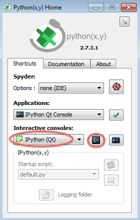

.. include:: subst.inc

Installation
============

In theory, installing a Python package should be as easy as py.  Er, pie.
Using `Pip <http://www.pip-installer.org/>`_.  Like so::

    $ pip install hisparc-sapphire

Then, the Python package called ``sapphire`` would be retrieved from the
internet.  It would have its dependencies listed and ``pip`` would pull
them in and all should be well.  In fact, |sapphire| *does* have its
dependencies listed and Pip *will* pull them in.  It is only then, that
things start go wrong.  Whether you'll experience difficulties depends on
the operating system you're using and any previously installed software.
But don't worry, we've got you covered.  Before I'll go on describing how
to install |sapphire| itself, we will first install the prerequisites.

Installing the prerequisites
----------------------------

Follow the instructions below for your operating system of choice.

Mac OS X
^^^^^^^^

If you're using Mac OS X, the easiest way to install open source software
(like Python, the program language we're using) including lots and lots of
great packages, is done using `Homebrew
<https://mxcl.github.com/homebrew/>`_.  Please follow the installation
instructions (really easy) and when done, type the following into a
terminal::

    $ brew install python

This will install Python and Pip.

As of this writing, several of the dependencies listed by |sapphire| do not
have their own dependencies listed in a way that Pip (or other tools, for
that matter) know how to handle.  Furthermore, matplotlib needs to be
installed all by itself, and its dependencies must be installed before it.

After trial and error, this is the magic incantation which works on my
system::

    $ pip install numpy
    $ pip install numexpr
    $ pip install cython
    $ pip install matplotlib

There are more prerequisites to be installed, but they are correctly
handled by the Python package management software.

Windows
^^^^^^^

While Python follows a *batteries included* philosophy with an extensive
standard library, the Unix philosophy favors minimalism.  Therefore, it is
custom to install Python and then continue to install additional packages
as needed.  Not so with Windows.  Windows does not have a package manager
which can handle many software packages.  Instead, it favors installing
relatively few software packages encompassing lots of functionality.
Installing a package requires running a separate installer.

Luckily, the `Python(x,y) <http://code.google.com/p/pythonxy/>`_ project
solves this problem by installing not only Python, but a complete
scientific environment.  This means that all our prerequisites are
automatically covered.  Please install Python(x,y).

In a Unix environment it is common to use the *terminal* for management
tasks.  It is a text-only environment that lets you basically do anything.
In windows, people are accustomed to performing all kinds of tasks using
graphical interfaces.  However, these graphical interfaces are much harder
to write than text-only interfaces.  As a result, graphical interfaces are
usually somewhat limited.  Luckily, there *is* a terminal-like environment
in Windows, called the *command prompt*.  You can open a command prompt in
the following ways:

    **Windows XP:**  Click Start.  Click Run.  Type ``cmd`` and press
    *Enter*.

    **Windows Vista, 7:**  Click Start.  Type ``cmd`` and press *Enter*.

    **Windows 8:**  From the Start Screen, type ``cmd`` and press *Enter*.

First, we'll install the modern Python package manager Pip::

    c:\> easy_install pip

This will probably try to open another terminal window, install Pip, close
the window, and *then* complain that easy_install is probably not
installed correctly (at least, this is how it went for us on Windows 7).
Just tell Windows the program *was* installed correctly.  Pip will not
have such idiosyncrasies and this was the last time we'll have used
``easy_install``.  Note that it is also possible to install Python(x,y)
and select the Pip package under *Python* in the installation options
menu.  This makes it unnecessary to manually run ``easy_install``.  The
end result is the same, however.

.. note::
    In the rest of this document, we will follow the Unix convention of
    displaying a dollar sign ($) whenever we work from a terminal.  In
    Unix environments, the dollar sign signifies the *command prompt*.  In
    Windows, the command prompt is something like ``c:\>``.  Thus, whenever
    you see::

        $ pip install foo

    we mean that you should open a command window, and then type ``pip
    install foo`` at the prompt.  In Windows, this looks something like::

        c:\> pip install foo

When you run Python(x,y), we found it best to select *IPython (Qt)* under
*Interactive consoles*, and run it in *Console 2* (the left, green, one).
See below.  This will automatically import Pylab, a plotting package.

Debian and derivatives (like Ubuntu)
^^^^^^^^^^^^^^^^^^^^^^^^^^^^^^^^^^^^

Debian has a first-class package manager which other distributions and
operating systems have a hard time competing with.  In my personal
opinion, anyway.  Lots of Python packages can be installed using
``apt-get``, but some of them might be outdated, depending on the age of
your distribution.  Use ``apt-get`` for Python packages at your own
discretion (read: risk).  Pip handles Python packages very well, so I'll
give some instructions using Pip.

As of this writing, several of the dependencies listed by |sapphire| do not
have their own dependencies listed in a way that Pip (or other tools, for
that matter) know how to handle.  Furthermore, matplotlib needs to be
installed all by itself, and its dependencies must be installed before it.

You need to install some development libraries::

    $ sudo apt-get install gfortran
    $ sudo apt-get install python-dev
    $ sudo apt-get install libfreetype6-dev
    $ sudo apt-get install libpng-dev
    $ sudo apt-get install libatlas-base-dev
    $ sudo apt-get install libhdf5-dev
    $ sudo apt-get install tk-dev

After trial and error, this is the magic incantation which works on my
system::

    $ sudo pip install numpy
    $ sudo pip install numexpr
    $ sudo pip install cython
    $ sudo pip install matplotlib

There are more prerequisites to be installed, but they are correctly
handled by the Python package management software.

Installing |sapphire|
---------------------

The |sapphire| package has been uploaded to `PyPI
<http://pypi.python.org>`_ so that Pip knows where to find it.

There are now several scenarios for installing |sapphire|: let Pip
install the release or development version or download the source code
and use setup.py to install it.

Just let me get to work!
^^^^^^^^^^^^^^^^^^^^^^^^

These scenarios do not involve fetching the code.  They will just
install |sapphire|, so that you can get to work.  To get the latest
stable release version, simply issue::

    $ pip install hisparc-sapphire

Done.  Now get to work.

If you like living on the edge with a possibly broken version of
|sapphire|, get the latest development version::

    $ pip install https://github.com/hisparc/sapphire/zipball/master

Let me see the code!
^^^^^^^^^^^^^^^^^^^^

You want to see the code so that you can change it, or follow the progress
of |sapphire|.  If you're interested in the development of |sapphire|, you
can either go to the `GitHub page <https://github.com/hisparc/sapphire/>`_
or install the version control system (we use `Git <http://git-scm.com>`_
yourself.  For that, please see the `GitHub Help pages
<https://help.github.com/articles/set-up-git>`_.

To just download the code and install |sapphire|, first go to
https://github.com/hisparc/sapphire/.  Then, click on the *Download ZIP*
button (see image below).  This will start a download of all the code
bundled in a zip file.

.. image:: images/github-zipball.png

You can also click the following link:
https://github.com/hisparc/sapphire/zipball/master.  Uncompress the zip
file, open a terminal and navigate to the top-level directory containing
the code.  Then issue::

    $ python setup.py install

This takes care of installing the missing dependencies and |sapphire|
itself.

Checking that |sapphire| is installed correctly
-----------------------------------------------

First off, the following is not an exhaustive check.  But it will tell you
if |sapphire| is, in fact, installed on your system and that Python knows
how to find it.

.. note:: When you run this check from *inside* the top-level |sapphire|
          code directory, it will always return successfully.  The reason
          for this is that Python also checks the current working
          directory for packges.  *So, run this check from e.g. your home
          directory.*

Start a Python session.  You can use a launcher of some type (e.g. the one
from Python(x,y)), or open a terminal and type::

    $ python

Or, if you prefer, `IPython <http://ipython.org>`_::

    $ ipython

In fact, we recommend using IPython for interactive use (install IPython
using ``pip install ipython``).  Then, try to import |sapphire|::

    >>> import sapphire

If this returns without an error message, all is well and |sapphire| is
correctly installed.
