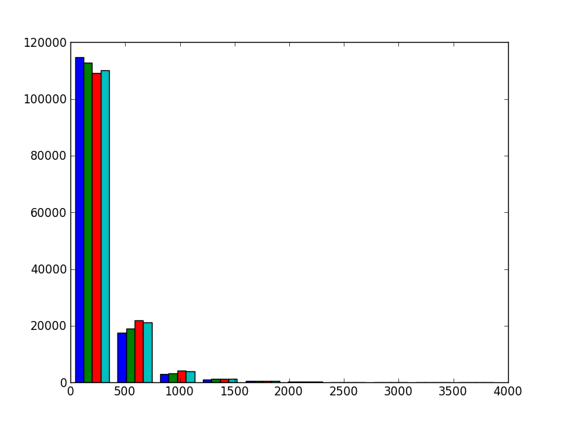
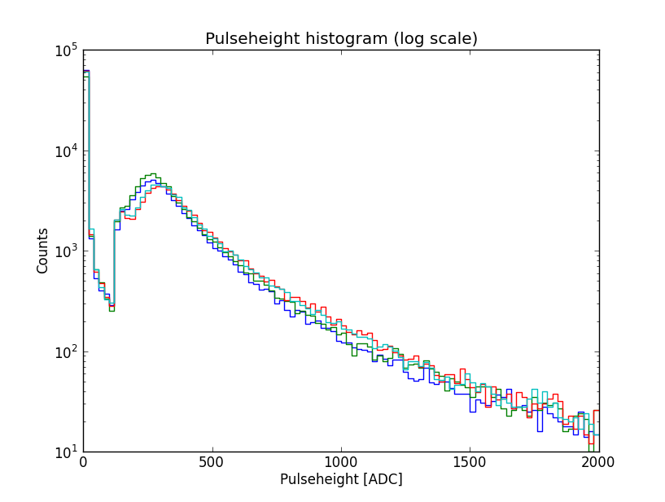

.. include:: subst.inc

Tutorial
========

|sapphire| simplifies data access, simulations and analysis for the `HiSPARC
<http://www.hisparc.nl>`_ experiment.  In this tutorial, we'll try to give
you a feeling for the things you can do with |sapphire|.  How can you
download data?  How can you analyze this data?  How can you produce
pulseheight histograms?  How can you calculate the direction of cosmic
rays?  This tutorial will only give you an overview of what's possible
with |sapphire|.  For details on all available classes and methods, please
see the :doc:`sapphire`.

.. note::
    We'll require you to know basic Python.  If you're unfamiliar with Python,
    you can look at the official `Python tutorial
    <http://docs.python.org/2/tutorial/>`_, the book `Think Python
    <http://www.greenteapress.com/thinkpython/>`_, or `Getting started with
    Python for science <http://scipy-lectures.github.io/intro/>`_.

First steps
-----------

In a few examples, we will plot the data which we have produced.  We make use
of pylab, which is included with matplotlib. If you have Anaconda installed,
you can use the Spyder environment. You can write a script in the main window,
or type short commands in the command prompt in the bottom right. The first
thing you have to do is import everything from pylab. That makes it
ridiculously easy to plot things::

    >>> from pylab import *

You can also start an IPython terminal with pylab using::

    $ ipython --pylab

In that case, you don't need to import pylab.

Whenever you see something like::

    >>> print 'Hello, world'
    Hello, world

it means we're typing in Python code.  The ``>>>`` is the Python *prompt*.
It tells you that the Python interpreter is waiting for you to give it
some instructions.  In the above example, we've typed in ``print 'Hello,
world'``.  The interpreter subsequently executed the code and printed
*Hello, world* on the screen.

The first thing we'll have to do to start using |sapphire| is to *import*
the |sapphire| module::

    >>> import sapphire

There will be no output if everything is succesful.  It is easy to get
some help from inside the Python terminal.  Just say::

    >>> help(sapphire)

and you'll be presented with a basic help screen.  Instead of
``sapphire``, you can throw in modules, packages, functions, classes,
objects, etc.  Everything in Python has *some* help text associated with
it.  Not all of it is very helpful to a newcomer, hence this tutorial.
All help text is also available in the :doc:`sapphire`.

Downloading and accessing |hisparc| data
----------------------------------------

The |sapphire| package comprises multiple modules and packages. To access data
from the public database, we'll have to import the :mod:`sapphire.esd` module.
This module gives us access to the *event summary data*, which is the raw
|hisparc| data with preliminary analysis already included. It is simple to
quickly start playing with data::

    >>> from sapphire import esd
    >>> data = esd.quick_download(102)
    100%|####################################|Time: 5.91
    >>> print data
    data8.h5 (File) ''
    Last modif.: 'Thu Oct 22 16:02:05 2015'
    Object Tree:
    / (RootGroup) ''
    /s102 (Group) ''
    /s102/events (Table(46382,)) ''

First, we import the :mod:`sapphire.esd` module. Then, we download data from
station 102 using the :func:`sapphire.esd.quick_download` function. This
function downloads yesterday's data, and creates a datafile on the fly. More on
that later.

If we want to exercise more control, we need to do some things manually. First,
we need the ``tables`` module to actually store the data. `PyTables
<pytables.org>`_ is based on the open HDF5 data format, which is used by `many
(research) institutes <http://www.hdfgroup.org/HDF5/users5.html>`_.  For
example, it is used by the KNMI and by NASA.  To specify the date and time for
which to download the data, we need the ``datetime`` module.  Thus, we have::

    >>> import tables
    >>> import datetime
    >>> from sapphire import esd

Creating an empty data file, with the name ``mydata.h5``, is done easily::

    >>> data = tables.open_file('mydata.h5', 'w')

The ``'w'`` means *write*, which creates a file for writing (and reading).
Mind that this will create an empty file.  If there already was a file
with that name, it will be overwritten!  Alternatively, you can say
``'a'``, which means *append*, thus adding to an existing file without
overwriting its contents.  Finally, you can specify ``'r'`` for
*read-only*.

Downloading data
^^^^^^^^^^^^^^^^

To download data, we have to specify the date/time *range*.  If we want to
download data from the December 1, 2012 all through December 2, 2012,
we can specify this by typing::

    >>> start = datetime.datetime(2012, 12, 1)
    >>> end = datetime.datetime(2012, 12, 3)

Mind that if we do not specify the hour of day, it is taken to be 00:00
hours.  Thus, there is no data included for December 3.  Alternatively,
we can download data from a two hour interval on October 17 by specifying
the hour of day::

    >>> start = datetime.datetime(2012, 10, 17, 19)
    >>> end = datetime.datetime(2012, 10, 17, 21)

which is from 19:00 to 21:00 hours.  It is important to realize that we use a
GPS clock, which is equal to UTC (up to some leap seconds).  So, if we download
data for a station in the Netherlands, we have just said from 20:00 to 22:00
local time (when it's not summer time).  You can specify the time up to the
second.

We have not actually done anything yet.  We have just stored our time
window in two arbitrarily-named variables, ``start`` and ``end``.  To
download data from station 501 and store it in a group with name ``/s501``,
we can use the :func:`sapphire.esd.download_data` function. Since we've
imported ``esd`` from ``sapphire``, we can drop the ``sapphire`` prefix::

    >>> esd.download_data(data, '/s501', 501, start, end)
    100%|####################################|Time: 0:00:16

It will show a progressbar to indicate the progress of the download.

As you can see in the reference documentation of
:func:`sapphire.esd.download_data`, available by either clicking on
the link or typing in ``help(esd.download_data)`` in the
interpreter, the function takes six arguments: *file, group, station_number,
start, end* and *type*.  The last one has the default argument
*'events'*, and may be omitted, as we have done here.  In our example, we
have opened a file, ``mydata.h5``, and have stored the file *handler* in
the variable ``data``.  So, we passed ``data`` to the function.  The group
name is ``/s501``.  Group names in PyTables are just like folders in a
directory hierarchy.  So, we might have specified
``/path/to/my/hisparc/data/files/for_station/s501``.  It is important to
note that this has absolutely nothing to do with *files*.  Whatever path
you specify, it is all contained *inside* your data file.  Since this is
just a small data file, we have opted for a simple structure.  At the
moment, just one group named ``s501`` at the root of the hierarchy.  Group
names must start with a letter, hence the ``s`` for station.

The *station_number* is simply the station number.  Here, we've chosen to
download data for station 501, located at Nikhef.  The *start* and *end*
parameters specify the date/time range.

Finally, *type* selects whether to download event or weather data should
be downloaded.  We've selected the default, which is *events*. We can also
download the weather data by changing the type to ``'weather'``::

    >>> esd.download_data(data, '/s501', 501, start, end, type='weather')
    100%|####################################|Time: 0:00:10

To access the raw data that includes the original detector traces the
:func:`sapphire.publicdb.download_data` function can be used instead. However,
downloading data will take much longer that way. If only some traces need to be
accessed, the :mod:`sapphire.api` is a better choice. We'll use that module
later in the tutorial.

Looking around
^^^^^^^^^^^^^^

If you want to know what groups and tables are contained within the data
file, just ``print`` it::

    >>> print data
    mydata.h5 (File) ''
    Last modif.: 'Sat Dec 29 14:50:55 2012'
    Object Tree:
    / (RootGroup) ''
    /s501 (Group) 'Data group'
    /s501/events (Table(137600,)) 'HiSPARC coincidences table'
    /s501/weather (Table(51513,)) 'HiSPARC weather data'

The *object tree* gives an overview of all groups and tables.  As you can
see, the ``/s501`` group contains two tables, ``events`` and ``weather``.
The events table contains the data from the |hisparc| scintillators, while
the weather table contains data from the (optional) weather station.

To directly access any object in the hierarchy, you can make use of the
``data.root`` object, which points to the root group.  Then, just specify
the remaining path, with dots instead of slashes.  For example, to access
the events table::

    >>> print data.root.s501.events
    /s501/events (Table(137600,)) 'HiSPARC coincidences table'

If you want, you can also access the object using its name as a string, by calling ``get_node`` on the file handler::

    >>> print data.get_node('/s501/events')
    /s501/events (Table(137600,)) 'HiSPARC coincidences table'

Of course, we'd like to get some more information.  You can drop the print
statement, and just access the object directly.  PyTables is set up such
that it will give more detailed information whenever you specify the
object directly::

    >>> data.root.s501.events
    /s501/events (Table(137600,)) ''
      description := {
      "event_id": UInt32Col(shape=(), dflt=0, pos=0),
      "timestamp": Time32Col(shape=(), dflt=0, pos=1),
      "nanoseconds": UInt32Col(shape=(), dflt=0, pos=2),
      "ext_timestamp": UInt64Col(shape=(), dflt=0, pos=3),
      "pulseheights": Int16Col(shape=(4,), dflt=0, pos=4),
      "integrals": Int32Col(shape=(4,), dflt=0, pos=5),
      "n1": Float32Col(shape=(), dflt=0.0, pos=6),
      "n2": Float32Col(shape=(), dflt=0.0, pos=7),
      "n3": Float32Col(shape=(), dflt=0.0, pos=8),
      "n4": Float32Col(shape=(), dflt=0.0, pos=9),
      "t1": Float32Col(shape=(), dflt=0.0, pos=10),
      "t2": Float32Col(shape=(), dflt=0.0, pos=11),
      "t3": Float32Col(shape=(), dflt=0.0, pos=12),
      "t4": Float32Col(shape=(), dflt=0.0, pos=13),
      "t_trigger": Float32Col(shape=(), dflt=0.0, pos=14)}
      byteorder := 'little'
      chunkshape := (819,)

There you go!  But what does it all *mean*?  Well, if you want to get to
the bottom of it, read the `PyTables documentation
<http://pytables.github.com/usersguide/index.html>`_.  We'll give a quick
overview here.

First, this table contains 137600 rows.  In total, there are fourteen
columns: ``event_id``, ``timestamp``, ``nanoseconds``, ``ext_timestamp``,
``pulseheights``, ``integrals``, ``n1``-``n4``, ``t1``-``t4`` and
``t_trigger``.

Each event has a unique [#event_id]_ identifier, ``event_id``.  Each
event has a Unix timestamp in GPS time, *not* UTC.  A `Unix timestamp
<http://en.wikipedia.org/wiki/Unix_time>`_ is the number of seconds that
have passed since January 1, 1970.  The sub-second part of the timestamp
is given in ``nanoseconds``.  The ``ext_timestamp`` is the full
timestamp in nanoseconds. Since there cannot exist another event with the same
timestamp, this field in combination with the station number uniquely
identifies the event. The ``pulseheights`` and ``integrals`` fields are
values derived from the PMT traces by the HiSPARC DAQ.  The ``n#``
columns are derived from the ``integrals`` and the ``t#`` and
``t_trigger`` fields are obtained after analyzing the event traces on
the server. For some fields there are four values, one for each detector.
If a station only has two detectors, the values for the missing two
detectors are -1.  If the baseline of the trace could not be determined
all these values are -999.

We'll get to work with this data in a moment.  First, we'll take a look at
the weather table::

    >>> data.root.s501.weather
    /s501/weather (Table(51513,)) 'HiSPARC weather data'
      description := {
      "event_id": UInt32Col(shape=(), dflt=0, pos=0),
      "timestamp": Time32Col(shape=(), dflt=0, pos=1),
      "temp_inside": Float32Col(shape=(), dflt=0.0, pos=2),
      "temp_outside": Float32Col(shape=(), dflt=0.0, pos=3),
      "humidity_inside": Int16Col(shape=(), dflt=0, pos=4),
      "humidity_outside": Int16Col(shape=(), dflt=0, pos=5),
      "barometer": Float32Col(shape=(), dflt=0.0, pos=6),
      "wind_dir": Int16Col(shape=(), dflt=0, pos=7),
      "wind_speed": Int16Col(shape=(), dflt=0, pos=8),
      "solar_rad": Int16Col(shape=(), dflt=0, pos=9),
      "uv": Int16Col(shape=(), dflt=0, pos=10),
      "evapotranspiration": Float32Col(shape=(), dflt=0.0, pos=11),
      "rain_rate": Float32Col(shape=(), dflt=0.0, pos=12),
      "heat_index": Int16Col(shape=(), dflt=0, pos=13),
      "dew_point": Float32Col(shape=(), dflt=0.0, pos=14),
      "wind_chill": Float32Col(shape=(), dflt=0.0, pos=15)}
      byteorder := 'little'
      chunkshape := (1310,)

We'll let these column names speak for themselves.

Accessing the data
^^^^^^^^^^^^^^^^^^

We can access the data in several ways.  We can address the complete
table, or just one or several rows from it.  We can read out a single
column, or select data based on a query.  Before we do any of that, we'll
save us some typing::

    >>> events = data.root.s501.events

Now, we have stored a short-hand reference to the events table. Let's get
the first event::

    >>> events[0]
    (0L, 1445385601, 613271528L, 1445385601613271528L, [3, 266, 400, 372],
     [0, 3090, 5695, 5621], 0.0, 1.03120, 1.55130, 1.58820,
     -999.0, 1002.5, 1000.0, 1022.5, 1030.0, -999.0, -999.0)

That's the first event!  It is not, however, immediately clear what
numbers correspond to which columns.  They are in order, however, so you
could find out.  It is often easier to specify the column you're
interested in::

    >>> events[0]['pulseheights']
    array([  3, 266, 400, 372], dtype=int16)

Which gives us the pulseheights of the first event.  You can recognize the same
numbers in the full event data above. The pulseheights are 16-bit integers
(that's the ``dtype=int16``) and are determined after digitizing the events
using an analog-digital converter (ADC).  Each unit corresponds to about -0.57
mV.  You can tell that all but the first detector had relatively large
pulseheights, and that they were registered as a significant *peak* in the
signal.

If you're interested in the pulseheights of *all* events, the fastest way
to do it is to make use of the ``Table.col`` method of the table::

    >> events.col('pulseheights')
    array([[  3, 266, 400, 372],
           [  4, 277, 887,   7],
           [ 72, 256,   6, 330],
           ...,
           [162,  78,   4, 299],
           [ 10,   6, 618, 446],
           [593, 621, 343,  13]], dtype=int16)

It is also possible to select the data based on a query.  For example, to
select all events between timestamps 1354320000 and 1354323600 (a one-hour
time span)::

    >>> t0 = 1354320000
    >>> t1 = t0 + 3600
    >>> sel_events = events.read_where('(t0 <= timestamp) & (timestamp < t1)')
    >>> len(sel_events)
    2836

Thus, we have selected 2836 events.  The variable ``sel_events`` no longer
points to a table.  We can no longer make use of the ``Table.col``
method, but we *can* access all pulseheights in the following way::

    >>> sel_events['pulseheights']
    array([[173,   3, 407,   3],
           [  1,   2, 313, 756],
           [211,   2,   2, 268],
           ...,
           [328, 556, 255,  15],
           [  3, 325, 309,   3],
           [  2,   2, 271, 381]], dtype=int16)

This notation is possible for arrays, but not for tables.  So, for tables,
use the ``Table.col`` method.  For arrays, use this special notation.

The :mod:`sapphire.time_util` module
^^^^^^^^^^^^^^^^^^^^^^^^^^^^^^^^^^^^

|sapphire| includes a handy module: :mod:`sapphire.time_util`.  This saves you
from the hassle of converting timestamps and confusing local time and GPS (or
UTC) time.  It is important to realize that the |hisparc| station uses a GPS
clock, and thus saves all timestamps in GPS time, which is certainly not local
time!  You can look up `GPS time
<http://en.wikipedia.org/wiki/Global_Positioning_System#Timekeeping>`_, but
suffice it to say that it is *almost* equal to UTC time.  The difference is the
leap seconds introduced after 1980.  In January 2013, GPS time was ahead of UTC
by 16 seconds.  Since July 2015, it is ahead by 17 seconds. We will not refer
to UTC or local time, but instead always refer to GPS time!

While you tell |sapphire| to download data using year, month, day, hour,
minutes, seconds notation, the events table contains timestamps.  It is
often hard to convert between the two.  For example, the correct
conversion between a GPS date/time and a GPS timestamp is given by::

    >>> calendar.timegm(datetime.datetime(2012, 12, 1, 0).utctimetuple())
    1354320000

Which is, at best, cumbersome.  It is easy, however, to screw up and
inadvertently convert to local time.  For your benefit, we have included
the :class:`sapphire.time_util.GPSTime` class.  You instantiate the class
by giving it a GPS time to work with.  It can either be in date/time
notation, or as a timestamp.  For example, the exact same result is
obtained by these two last lines of code::

    >>> import sapphire.time_util
    >>> sapphire.time_util.GPSTime(2012, 12, 1)
    >>> sapphire.time_util.GPSTime(1354320000)

If you store the instance, you can then call several methods to convert
the date/time to whatever you require::

    >>> gpstime = sapphire.time_util.GPSTime(2012, 12, 1)
    >>> gpstime.datetime()
    datetime.datetime(2012, 12, 1, 0, 0)
    >>> gpstime.description()
    'Sat Dec  1 00:00:00 2012'
    >>> gpstime.gpstimestamp()
    1354320000

Or, indeed::

    >>> gpstime = sapphire.time_util.GPSTime(1354320000)
    >>> gpstime.datetime()
    datetime.datetime(2012, 12, 1, 0, 0)
    >>> gpstime.description()
    'Sat Dec  1 00:00:00 2012'
    >>> gpstime.gpstimestamp()
    1354320000

It is now easy to select events occuring between 12:00 and 13:00 hours GPS
time on December 2, 2012::

    >>> t0 = sapphire.time_util.GPSTime(2012, 12, 2, 12).gpstimestamp()
    >>> t1 = sapphire.time_util.GPSTime(2012, 12, 2, 13).gpstimestamp()
    >>> t0, t1
    (1354449600, 1354453200)
    >>> sel_events = events.read_where('(t0 <= timestamp) & (timestamp < t1)')
    >>> len(sel_events)
    2817

And when did the tenth event occur?  Well::

    >>> t = sel_events[9]['timestamp']
    >>> t
    1354449620
    >>> sapphire.time_util.GPSTime(t).description()
    'Sun Dec  2 12:00:20 2012'

To shorten the typing somewhat, remember that in Python you can import
classes from modules into your own namespace::

    >>> from sapphire.time_util import GPSTime
    >>> GPSTime(t).description()
    'Sun Dec  2 12:00:20 2012'

Plotting data
^^^^^^^^^^^^^

Now that we can access the data, we want to visualize it.  Plotting data
is a great way to do that.  And of course, the venerable histogram is
still very useful to condense thousands of events into one display.  Pylab
contains an easy function to do just that: ``hist``.  Let's try to
recreate a few graphs as seen on the |hisparc| `data display
<http://data.hisparc.nl/show/stations/501/2012/12/1/>`_::

    >>> ph = events.col('pulseheights')
    >>> hist(ph)
    ([array([114794,  17565,   3062,   1009,    502,    285,    170,     86,
               72,     55]), array([112813,  19028,   3339,   1246,    540,    295,    163,    100,
               66,     10]), array([109162,  21833,   4246,   1345,    579,    290,    113,     32,
                0,      0]), array([109996,  21283,   4028,   1285,    581,    251,    133,     43,
                0,      0])], array([  1.00000000e+00,   3.91100000e+02,   7.81200000e+02,
             1.17130000e+03,   1.56140000e+03,   1.95150000e+03,
             2.34160000e+03,   2.73170000e+03,   3.12180000e+03,
             3.51190000e+03,   3.90200000e+03]), <a list of 4 Lists of Patches objects>)

This will not do.  Firstly, data from the four detectors is pictured as
four side-by-side colored bars.  Secondly, the number of bins is very low;
it is only ten.  Thirdly, the data range continues up to very high values
with hardly any events.

To fix this, we'll make use of several arguments that can be passed to the
``hist`` function.  We'll also make use of some NumPy (`documentation
<http://docs.scipy.org/doc/numpy/user/>`_) functionality.  For Pylab
documentation, see the `Matplotlib site <http://matplotlib.org>`_
(`function reference
<http://matplotlib.org/1.2.0/api/pyplot_summary.html>`_).  Try this::

    >>> bins = linspace(0, 2000, 101)
    >>> hist(ph, bins, histtype='step', log=True)
    >>> xlabel("Pulseheight [ADC]")
    >>> ylabel("Counts")
    >>> title("Pulseheight histogram (log scale)")

The ``linspace`` function returns an array with range from 0 to 2000 with a
total number of 101 values. The first value is 0, the last is 2000. These are
the *edges* of the bins. So, 101 values means exactly 100 bins between 0 and
2000. The ``hist`` function will then plot a *stepped* histogram with a log
scale.  Finally, we add some labels and a title.  This is the result:

In this plot, the gamma and charged particle part of the spectrum are easy
to distinguish.  The cut at 123 ADC is due to the trigger.  The bump at
approximately 300 ADC is the so-called MIP (minimum ionizing particle)
peak.  For an explanation of this plot and the features of the pulseheight
histogram, see `David's thesis
<http://www.nikhef.nl/pub/services/biblio/theses_pdf/thesis_D_Fokkema.pdf>`_,
page 44–45, and 49–51.

Obtaining coincidences
----------------------

If you work with |hisparc| data, invariably you'll be interested in
*coincidences* between |hisparc| stations.  That is, are there showers
which have been observed by multiple stations?  To find out, we'll make
use of the :mod:`sapphire.analysis.coincidences` module.

Performing the search
^^^^^^^^^^^^^^^^^^^^^

Consider the following script, which you can hopefully understand by now
(note that the prompt (``>>>``) is absent, since this is a *script*::

     import datetime

     import tables

     from sapphire import download_data, CoincidencesESD

     STATIONS = [501, 503, 506]
     START = datetime.datetime(2013, 1, 1)
     END = datetime.datetime(2013, 1, 2)

     if __name__ == '__main__':
         station_groups = ['/s%d' % u for u in STATIONS]

         data = tables.open_file('data.h5', 'w')
         for station, group in zip(STATIONS, station_groups):
             download_data(data, group, station, START, END)

At this point, we have downloaded data for three stations. Note that we
used the :mod:`sapphire.esd` for downloading. Thus, we have no traces
and the download is quick. Let's see what the datafile now contains::

    >>> print data
    data.h5 (File) ''
    Last modif.: 'Mon Jan 14 17:34:39 2013'
    Object Tree:
    / (RootGroup) ''
    /s501 (Group) 'Data group'
    /s501/events (Table(70643,)) ''
    /s503 (Group) 'Data group'
    /s503/events (Table(34937,)) ''
    /s506 (Group) 'Data group'
    /s506/events (Table(68365,)) ''

It contains three groups, one for each station.  To search for
coincidences between these stations, we first initialize the
:class:`sapphire.analysis.coincidences.CoincidencesESD` class like so::

    >>> coincidences = CoincidencesESD(data, '/coincidences', station_groups)

From the documentation (click on the class above the example to go to the
documentation) it is clear that we have to specify the datafile
(``data``), the destination group (``/coincidences``) and the groups
containing the station data (``station_groups``).  Once that's done, there
is an easy way to search for coincidences, process the events making up
the coincidences, and store them in the destination group::

    >>> coincidences.search_and_store_coincidences(station_numbers=STATIONS)
    100%|######################################|Time: 0:00:02
    100%|######################################|Time: 0:00:00

If you want to tweak the process using non-default parameters, see the
module documentation (:mod:`sapphire.analysis.coincidences`).  For now,
let us turn to the results::

    >>> print data
    data.h5 (File) ''
    Last modif.: 'Mon Jan 14 17:46:23 2013'
    Object Tree:
    / (RootGroup) ''
    /coincidences (Group) u''
    /coincidences/c_index (VLArray(2184,)) ''
    /coincidences/coincidences (Table(2184,)) ''
    /coincidences/s_index (VLArray(3,)) ''
    /s501 (Group) ''
    /s501/events (Table(70643,)) ''
    /s503 (Group) ''
    /s503/events (Table(34937,)) ''
    /s506 (Group) ''
    /s506/events (Table(65935,)) ''

The new addition is the ``/coincidences`` group.  It contains three
tables, which are ``c_index``, ``coincidences`` and ``s_index``.
Information about the coincidences is stored in the ``coincidences``
table.  Let's look at the columns:

=============== ===========
column          description
=============== ===========
id              an index number identifying the coincidence
timestamp       the unix timestamp
nanoseconds     the nanosecond part of the timestamp
ext_timestamp   the timestamp in nanoseconds
N               the number of stations taking part in the coincidence
x               *compatibility reasons*
y               *compatibility reasons*
azimuth         *compatibility reasons*
zenith          *compatibility reasons*
size            *compatibility reasons*
energy          *compatibility reasons*
s501            flag to indicate if the first station is in coincidence
s503            as previous but for second station
s506            as previous but for third station
=============== ===========

The columns included for compatibility reasons are used by the event
simulation code.  In that case, the ``x``, ``y`` columns give the
position in cartesian coordinates.  Furthermore, the ``size`` and
``energy`` give the so-called *shower size*, and ``zenith`` and
``azimuth`` contain the direction of the (simulated) shower.  These are
not known for certain when working with |hisparc| data, but are included
nonetheless.  These columns are all set to 0.0.

The ``c_index`` array is used as an index to look up the tables and
individual events making up a coincidence.  The second coincidence is
accessed by::

    >>> data.root.coincidences.coincidences[1]
    (2L, 1356998460, 730384055L, 1356998460730384055L, 2, 0.0, 0.0, 0.0,
     0.0, 0.0, 0.0, True, False, True)

Remember, the indexes are zero-based.  The coincidence id is also 2::

    >>> data.root.coincidences.coincidences[2]['id']
    2

and the number of stations participating is 2::

    >>> data.root.coincidences.coincidences[2]['N']
    2

To lookup the indexes of the events taking part in this coincidence,
access the ``c_index`` array using the same id::

    >>> data.root.coincidences.c_index[2]
    array([[ 0, 40],
           [ 2, 57]], dtype=uint32)

That is, event id 40 from station 0, event id 57 from station 2 are part
of this coincidence.  The event observables are still stored in their
original location and can be accessed using the ids. To find the
location of the station group the ``s_index`` contains the paths to the
station groups.::

    >>> data.root.coincidences.s_index[0]
    '/s501'
    >>> data.get_node('/s501', 'events')[40]
    (40L, 1356998460, 730384055L, 1356998460730384055L, [2, 227, 301, 2],
     [0, 1657, 3173, 0], 0.0, 0.5117999911308289, 0.9417999982833862,
     0.0, -999.0, 12.5, 57.5, -999.0, 62.5)

Downloading coincidences
^^^^^^^^^^^^^^^^^^^^^^^^

Just like events or weather data for a single station the ESD provides
coincidence data. This means that you can directly download coincidences from
the server. In most cases this can save a lot of disc space, because only
events in a coincidence will be stored.

Downloading coincidences is very similar to downloading data. First import the
required packages, open a PyTables file, and specify the date/time *range*.
With coincidences two additional options are available, first you can select
which stations you want to consider. This can be *all* stations in the
network, by not specifying any. It can be a subset of stations by listing
those stations (upto 30 stations), or a cluster of stations by giving the name
of the cluster.

So first import the packages::

   >>> import datetime
   >>> import tables
   >>> from sapphire import esd

Set the date/time range::

   >>> start = datetime.datetime(2012, 12, 1)
   >>> end = datetime.datetime(2012, 12, 3)

Open (in this case create) a datafile::

   >>> data = tables.open_file('data_coincidences.h5', 'w')

Then download the coincidences. Here we specify the cluster 'Enschede' to
select all stations in that cluster. By setting *n* to 3 we require that a
coincidence has at least 3 events.

   >>> esd.download_coincidences(data, cluster='Enschede',
   ...                           start=start, end=end, n=3)

If you now look in the data file it will contain event tables for all stations
with at least one event in a coincidence, and a coincidence table for the
coincidence data. Just like when coincidences were searched manually::

   >>> print data
   Object Tree: 
   / (RootGroup) ''
   /coincidences (Group) ''
   /coincidences/c_index (VLArray(776,)) ''
   /coincidences/coincidences (Table(776,)) ''
   /coincidences/s_index (VLArray(124,)) ''
   /hisparc (Group) ''
   /hisparc/cluster_enschede (Group) ''
   /hisparc/cluster_enschede/station_7001 (Group) ''
   /hisparc/cluster_enschede/station_7001/events (Table(776,)) ''
   /hisparc/cluster_enschede/station_7002 (Group) ''
   /hisparc/cluster_enschede/station_7002/events (Table(776,)) ''
   /hisparc/cluster_enschede/station_7003 (Group) ''
   /hisparc/cluster_enschede/station_7003/events (Table(776,)) ''

.. rubric:: Footnotes

.. [#event_id]

    Unique in this table.  When data is downloaded for analysis and
    combined with other data into one table, the ``event_id`` will be
    different.  To uniquely define an event, use a station number /
    ``ext_timestamp`` combination.
